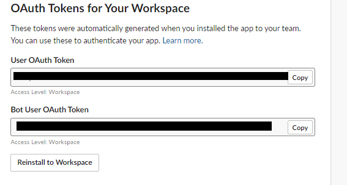

# Slack messages API
 A java application built to send messages(with a BotApp) in your Slack workspace using Web APIs. Indicated for team members.

 [_Um aplicativo Java criado para enviar mensagens (com um BotApp) em seu espaço de trabalho Slack usando APIs da Web. Indicado para membros de equipe_].
 
 It's very common to see in a Development Team collaborative applications being used for helping in the internal communication between members. I decided to build this app because Slack is one of the most popular remote tools in the world and It is no secret that remote work tools are exploding in popularity as more and more people are required from home. This repository is just a guide I hope that you can start building your own slack app.

 <h3 align="center">
    
    
</h3>
  

   <a href="https://github.com/gabriel-silva-kothe">
   
 

  </a>

## Step by step

-  [Create a Slack App](https://api.slack.com/apps) 

-  [Add features and functionality](https://api.slack.com/apps) 
In my case I just needed to configure permissions and to add the app Boot in the workspace because I'll to manage the requisitions in the code.

-  [Bot Token Scopes](https://api.slack.com/apps) 

-  [You'll need to Add this OAuth Scopes](https://api.slack.com/apps) 

-  [Generate the token that will be used in the application(Bot User Token)](https://api.slack.com/apps) 

-  [Finally you'll need to install at your workspace this app](https://api.slack.com/apps) 

-  [Let's code!](https://slack.dev/java-slack-sdk/guides/web-api-basics) 

 

## :interrobang: API Methods

Slack has a complete list of all the methods that you’ll be able to use, here. Each method has its own documentation page, that will provide everything you’ll need to start using it.  <a href="https://api.slack.com/start/overview">An introduction to the Slack platform </a>.

## *References*

- [The art of crafting a Slack app 
your team will love](https://slack.dev/guides/Build.pdf)
- [Building great user experiences
on Slack](https://slack.dev/guides/AppUIGuidelines.pdf)
- [Slack Api Overview](https://api.slack.com/start/overview)

## :dart: Como contribuir(How can You contribute?)

- Faça um _Fork_ deste repositório;
- Crie uma _branch_ com a sua feature: `git checkout -b my-feature`
- _Commit_ suas mudanças: `git commit -m 'feat: My new feature'`
- Faça um _push_ da sua branch: `git push origin my-feature`
